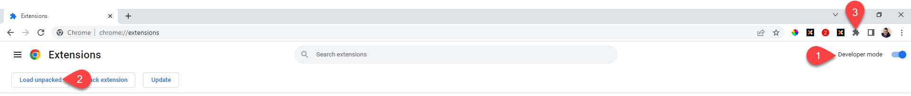

This project was bootstrapped with [Create React App](https://github.com/facebook/create-react-app).

## Available Scripts

In the project directory, you can run:

### `npm test`

Launches the test runner in the interactive watch mode. 
See the section about [running tests](https://facebook.github.io/create-react-app/docs/running-tests) for more information.

### `npm run build`

Builds the app for production to the `build` folder. 
It correctly bundles React in production mode and optimizes the build for the best performance.

The build is minified and the filenames include the hashes. 
Your app is ready to be zipped and then submitted to the chrome store or to load it locally in the chrome extensions 

### `npm run eject`

**Note: this is a one-way operation. Once you `eject`, you can’t go back!**

If you aren’t satisfied with the build tool and configuration choices, you can `eject` at any time. This command will remove the single build dependency from your project.

Instead, it will copy all the configuration files and the transitive dependencies (webpack, Babel, ESLint, etc) right into your project so you have full control over them. All of the commands except `eject` will still work, but they will point to the copied scripts so you can tweak them. At this point you’re on your own.

You don’t have to ever use `eject`. The curated feature set is suitable for small and middle deployments, and you shouldn’t feel obligated to use this feature. However we understand that this tool wouldn’t be useful if you couldn’t customize it when you are ready for it.

## Load the extension without publishing it to the chrome store.

To see your extension in the browser you need to: 
- Build the code `npm run build` so that it produce a build folder
- Open Chrome browser and set the URL to `chrome://extensions`
- Make sure Developer mode is enabled (Step 1)
- Click `Load unpacked` it will then open a file explorer.(Step 2)
- Navigate and select your `[extension_name]/build` folder
- Congratulations you have successfully loaded the new extension into the browser. You can now access it by clicking on the Extension icon (Step 3)

## Colaborators
- Ruan de Villiers